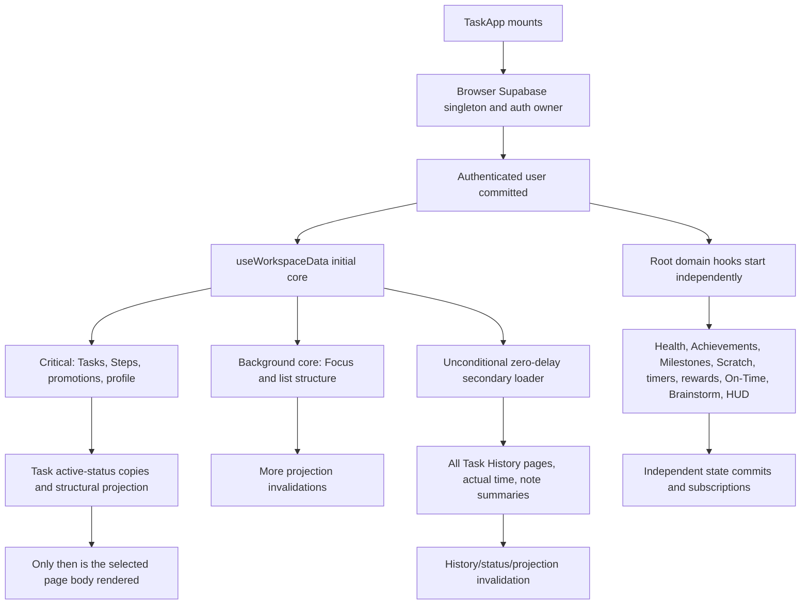
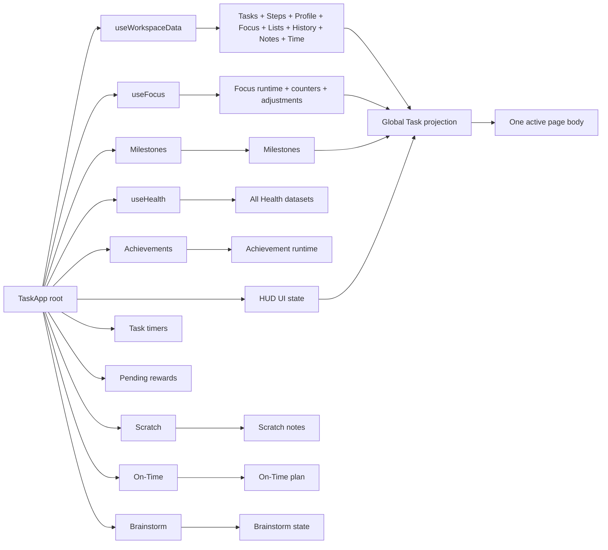

# Workspace Loading and Render Architecture

Status: source-based diagnostic for ADHDice 7.6.23  
Date: 2026-08-01  
Scope: loading, ownership, refresh, projection, and paint diagnostics only

This document does not propose changes to Task State Engine semantics, recurrence, History authority, rewards, Calendar behavior, task actions, or visible product behavior. No browser trace or live Supabase request capture was available during this pass, so runtime multiplicity caused by tabs, remounts, Safari process eviction, BFCache, or deployed-version drift remains to be measured.

## Confirmed root causes

1. `TaskApp` is the owner of nearly every domain hook. The page switch is below those hooks, so Health, Focus, Achievement, Milestone, Scratch Paper, task timer, pending reward, On-Time, Brainstorm, HUD, and core workspace owners start before their pages are selected.
2. `useWorkspaceData` calls its “secondary” loader unconditionally after core load. Page checks only choose immediate execution versus `setTimeout(..., 0)`; they do not defer Task History, actual-time entries, or note summaries until a consumer opens.
3. A single workspace Realtime channel maps changes in ten unrelated tables to the same full core refresh. That refresh reselects Tasks, Steps, profile, Focus history, list structure, memberships, and grid layout.
4. Canonical projection combines hierarchy, smart/manual list membership, search, filters, History-derived facts, facet counts, milestone facts, notes, grid/editor selection, and final page models. At approximately 898 Tasks, it repeatedly traverses Tasks and reevaluates lists/facets instead of reusing entity facts by Task revision.
5. The minute clock recomputes active status for every Task. `projectTasksForActiveStatusRead` then clones every Task even if no displayed status changed, invalidating hierarchy and the complete task derivation once per minute.
6. Startup is staged across independent owners. Task rows, History, lists, notes, milestones, Focus, and settings arrive in separate commits, producing several legitimate but nearly adjacent derivations of the same Task database revision.
7. Development can add React render replay to those runs. The new diagnostic labels a run with `changed=none (repeat evaluation)` so replay can be distinguished from real source invalidation.
8. Search is deferred, but each applied deferred value still enters the global canonical projection. A 1.3–1.6 second synchronous projection can therefore block the controlled input paint and make typed text appear many seconds late when several invalidations queue together.

## Current startup sequence

The per-user startup registry deduplicates only a currently in-flight core request. It is not a completed-result cache for a later remount, document, tab, or Safari process restoration.

## Startup queries and returned data

“Always” means the owner is mounted at authenticated `TaskApp` root, not that every conditional migration query runs on every account.

| Owner | Timing | Table/RPC | Selection and result |
|---|---|---|---|
| `useWorkspaceData` critical | Always | `adhdice_clean_tasks` | `select("*")`; every user Task, ordered by status/sort/creation |
|  | Always | `adhdice_task_subtasks` | `*`; all legacy Step rows |
|  | Always | `adhdice_legacy_subtask_promotions` | `*`; all promotion bridge rows |
|  | Always | `adhdice_user_profiles` | workspace profile columns: display/theme/logical-day/economy/settings metadata |
| `useWorkspaceData` background core | Always | `adhdice_focus_categories` | `*`; every Focus category |
|  | Always | `adhdice_focus_sessions` | `*`; complete Focus session history, newest first |
|  | Always | `adhdice_task_focus_days` | `*`; all dated Focus selections |
|  | Always | `adhdice_task_lists` | `*`; all custom list definitions and rules |
|  | Always | `adhdice_task_list_manual_memberships` | `*`; all manual memberships |
|  | Always | `adhdice_task_grid_layouts` | `*`; one grid layout row |
|  | Always | `adhdice_task_list_folders` | `*`; all folders |
|  | Always | `adhdice_task_list_containers` | `*`; all list containers |
|  | Always | `adhdice_task_list_rail_items` | `*`; all canonical rail placements |
| Profile media | After critical core | `adhdice_user_profiles` | avatar/logo columns; session-cached after success |
| `useWorkspaceData` secondary | Always after core; merely zero-delay on most pages | `adhdice_task_history` | sequential 1,000-row `select("*")` pages; all History |
|  | Same | `adhdice_task_actual_time_entries` | `*`; all actual-time evidence |
|  | Same | `adhdice_notes` | `id,title,body,linked_task_ids,updated_at`; all note text and links |
| `useFocus` | Always | `adhdice_focus_daily_goal_adjustments` | current week adjustments |
|  | Always and on lifecycle/channel status | `adhdice_focus_active_sessions` | open runtime rows and revisions |
|  | Always after migration and on lifecycle/channel status | `adhdice_focus_counters` | all nondeleted counters |
|  | Same | `adhdice_focus_counter_events` | complete counter event history |
|  | Conditional | Focus migration RPCs | legacy runtime/counter migration and authoritative snapshots |
| `useHealth` | Always | 11 Health tables | profile; all check-ins, meals, food library, recipes, saved meals, water, weight, metrics, import audits, and awards |
|  | Conditional after load | Health award RPC/select | checks and claims newly eligible awards |
| `useScratchNotes` | Always | `adhdice_scratch_notes`, `adhdice_scratch_note_task_links` | all scratch notes and all Task links |
| `useTaskTimers` | Always | `adhdice_task_active_timers` | all active timer rows |
| `useMilestoneData` | Always | `adhdice_milestones` | all milestones; current subscribe flow can load once directly and again on `SUBSCRIBED` |
| `useAchievementProgress` | Always | four Achievement tables | profile, progress, tier awards, collection awards |
| Achievement notifications | After Achievement readiness | claim RPC | unseen notification claims/celebrations |
| `useTaskUiState` | Always | `adhdice_hud_ui_settings` | one HUD and task-table settings envelope |
| `useTaskRewardController` | Always | pending reward account/items | dice balance revision and every unclaimed reward payload; migration RPC may precede refresh |
| `useOnTimePlan` | Always despite `active` argument | `adhdice_on_time_plans` | one complete plan-state row |
| `useBrainstormState` | Always despite `active` argument | `adhdice_brainstorm_state` | source markdown, answers, QA state, update timestamp |
| Rail reconciliation effect | After built-ins and again after hydrated manifest if fingerprint changes | `adhdice_reconcile_task_list_rail` path | canonical rail placement result |

Page-mounted queries are separate: Home loads `adhdice_home_todo_state`; Roll loads its profile/prize data; Notes loads full note rows again; Records is mounted inside Progress but its `active` flag gates the full Records pipeline; Reports paginate selected Task History, Focus sessions, adjustments, milestones/events, achievements, and Records when that surface is opened.

## Current Realtime ownership

| Channel owner | Tables/events | Consequence |
|---|---|---|
| `useWorkspaceData` Task channel | all changes to `adhdice_clean_tasks` | reload every Task row unless a local mutation suppression matches |
| `useWorkspaceData` workspace channel | subtasks, list folders, list containers, rail items, promotions, Focus categories, Focus days, Task lists, memberships, grid layouts | any event requests the entire core workspace refresh |
| Same workspace channel | notes, actual-time entries, Task History | reloads the entire secondary bundle after it has loaded |
| `useFocus` runtime | active sessions; inserted Focus sessions | row-applies runtime, inserts Focus history, and rehydrates runtime on channel states/lifecycle |
| `useFocus` counters | counters and inserted counter events | row-applies changes and rehydrates snapshots on channel states/lifecycle |
| `useTaskRewardController` | pending reward account | applies account revision, then refreshes account plus all unclaimed items |
| `useTaskTimers` | active timers | reloads all active timers |
| `useMilestoneData` | milestones | row merge/delete; subscription also initiates a full milestone reload |
| `useTaskUiState` | HUD settings | reloads the HUD/settings envelope |
| `useOnTimePlan` | On-Time plan | applies remote plan; channel exists while its surface is inactive |
| `useBrainstormState` | Brainstorm state | applies remote state; channel exists while its surface is inactive |
| `useHomeTodoState` | Home state | Home-page scoped; reloads/reconciles Home IDs |
| `RollPage` | user profile | Roll-page scoped profile/reward reload |

There is no Realtime owner in `useHealth`, `useScratchNotes`, or Achievement progress. Their eager snapshots can therefore become stale while still adding startup cost.

## Full-workspace refresh triggers

Core refresh (`Tasks`, Steps, profile, Focus categories/history, Focus days, all list structure/memberships, and grid layout):

- authenticated initial load;
- manual HUD/Settings refresh;
- a mutation preparation path when a resume sync is pending;
- recovery after at least five minutes hidden, offline-to-online recovery, or persisted BFCache restore;
- any workspace-channel event in the ten core tables listed above;
- list-folder actions that call the shared refresh after mutation/conflict.

Task-only reload:

- any unsuppressed Task Realtime event;
- successful rollover reconciliation.

Secondary bundle reload (all History pages plus all actual-time entries and note summaries):

- its unconditional post-core startup call;
- manual/resume refresh if already loaded or a nominal consumer page is active;
- any Realtime change to History, actual-time entries, or notes;
- rollover reloads all History again once startup History is ready.

Independent Focus, reward, timer, milestone, HUD, On-Time, and Brainstorm owners also refresh on their own channel/lifecycle rules. They are not coordinated with the workspace revision, so one external action can cause several commits.

## Task derivation call sites and invalidation

Production root call chain:

1. `taskHistoryByTaskId`: groups all loaded History.
2. `taskHistoryFactsByTaskId` and `currentStreakByTaskId`: scan per-Task History.
3. `resolveActiveTaskStatuses`: evaluates every active Task through the Task State Engine.
4. `projectTasksForActiveStatusRead`: clones every Task into a presentation array.
5. `buildTaskAppStructuralData`: hierarchy, diagnostics, primary visibility, and child previews.
6. `computeTaskAppDerivedData`: canonical projection plus all Task workspace aggregates and page models.
7. Row adapters build table/editor presentation rows downstream; the shared editor now memoizes its all-Task row map only while open.

Other hierarchy/derivation callers exist in CRUD descendant checks, sibling reorder, Reports, and PATHS, but they are action- or page-scoped rather than the repeated root projection.

### Dependencies that invalidate the complete projection

- Task presentation array (therefore raw Task rows, active-status result, History, logical-day clock, timezone, or rollover time);
- grouped History and History-derived list context;
- Step map and structural hierarchy result;
- available list definitions, rules, manual memberships, routing, Focus selections, streaks, milestone sets, and History facts;
- note summaries and links;
- milestone search-token and Task-ID sets;
- search query, selected bucket, view, include-Steps choice, quick/energy/status/column filters, and match-any mode;
- Task grid layout;
- selected Task editor ID and actual-time editor ID;
- logical day key.

Active page is intentionally no longer a dependency in the current 7.6.22 dirty recovery work; the computation stays scoped to `Tasks`. Mouse movement, row hover, ordinary menu open state, overlay animation, HUD widget movement, and message state rerender `TaskApp` but do not by themselves invalidate the memo. Exceptions are root overlay identifiers included above, Focus/HUD changes that alter projection inputs, and any menu action that changes Task filters, lists, routing, Focus selection, or grid layout.

### Why the same Task revision derives more than once

- Task DB revision is only one of many projection revisions. List, History, notes, milestone, grid, Focus, and settings snapshots arrive independently.
- The minute clock creates a new active-status map and a full cloned Task array even when statuses are identical.
- Milestone startup can issue two loads; Focus and pending-reward channels can hydrate before and again when subscription status changes.
- a full core refresh applies critical Tasks first and background list/Focus details later;
- the unconditional secondary loader then applies History, time, and notes;
- React development render replay can execute a memo calculation twice without a changed dependency;
- search intentionally produces a new projection for each deferred query value.

The development log distinguishes these cases with computation/source owner, `previous->next` computation revision, exact reference names changed, Task/History/list/settings reference revisions, actual active page, and duration. It stores no Task text, note text, search text, or other content.

## Mounted pages and page-to-dataset dependencies

Only the selected top-level page body is inserted by the `activePage` conditional. Inactive top-level page components are unmounted. Their root hooks, however, remain mounted because they are called above the conditional. Within Tasks, only the selected Tasks surface is inserted. Within Progress, `RecordsTab` remains mounted in a hidden panel, but `active=false` prevents its pipeline until selected.

| Page/surface | Data actually consumed | Currently eager elsewhere | Appropriate load boundary |
|---|---|---|---|
| Global shell/HUD | profile theme/logical day, HUD envelope, pending reward count, active timers, compact notification counts | most domains | bootstrap cache |
| Home | Home ordered Task IDs; compact Task status/title/list facts; milestones summary | all Tasks, History, lists, milestones | Home loader plus shared compact Task read model |
| Tasks table/list/cards/grid | Tasks, recurrence/status projection, hierarchy/Steps, lists/rules/memberships, Focus selections, relevant History facts, note link summaries, milestones, grid settings | yes | Tasks workspace cache |
| Tasks PATHS | Tasks, status map, lists/memberships, PATHS records | Task data eager | PATHS loader plus shared Task summaries |
| Tasks Report | selected-range Task/Focus History, adjustments, milestones/events, Achievement and Records snapshots | partial/full histories eager and refetched | report-range loader |
| Tasks On-Time | plan, Task summaries/status, timers, actual-time/learned duration evidence | plan and all actual-time eager | surface-owned plan and duration loader |
| Tasks Brainstorm | one Brainstorm state row | eager | surface-owned loader/subscription |
| Completed Milestones | milestones and referenced Tasks | milestones eager | Progress/Tasks milestone cache |
| Focus | categories, runtime, sessions, counters/events, weekly adjustments | all eager | Focus page loader; keep only active runtime globally if HUD needs it |
| Health | eleven Health datasets plus Sleep Focus bridge | all eager | Health page loader with subtab/date-range loaders |
| Roll | profile economy/reward inventory and Roll assets | page-scoped now | keep page-scoped |
| Progress/Achievements | four Achievement tables, notifications; milestones on Milestones tab | all eager | Progress loader, then tab loaders |
| Progress/Records | paged Tasks, Task History, Focus sessions; current/events | correctly gated by active tab | retain page-scoped single-flight cache |
| Stats | Tasks, Task History, Focus History, economy, Achievement summary | all eager | Stats range loader or cached aggregates |
| Notes | note rows, scratch notes/links, Task picker summaries | notes/scratch eager; Notes refetches | Notes loader and one canonical notes cache |
| Settings | profile/HUD settings; Tasks only for import/export style functions | Tasks eager | settings loader; explicit export loader |
| Games | Task History and economy | History eager | Games aggregate/range loader |

## Fields genuinely required globally

No page needs the complete `adhdice_clean_tasks select("*")` shape merely to render the global shell. The current global rollover authority does require enough Task state and History to preserve behavior before page-scoping can be completed.

A conservative global Task-state snapshot would contain only:

- identity/ownership/concurrency: `id`, `user_id`, `revision`, `updated_at`, lifecycle status;
- hierarchy/order needed by state planning: `parent_task_id`, sibling order, lifecycle timestamps;
- status/occurrence/recurrence inputs already consumed by the Task State Engine and rollover planner: persisted status, due/delay/active-occurrence/completion fields, repeat frequency/interval/days/monthly configuration, and required task-type flags;
- minimal reward/streak eligibility fields already required by the unchanged planner;
- profile timezone and day-start setting.

Task title is required only by visible Task pickers, Home, timers, notifications, and editors, not by recurrence evaluation. Notes, links, tags, list presentation, energy, estimates, rich metadata, and UI-only fields should be fetched with the consuming page or Task detail. Before narrowing the SQL select, an explicit field-usage contract test must be built from the Task State Engine adapter and rollover planner; silently omitting a recurrence field is a high-risk migration.

History cannot simply be removed from startup while the current client-side Task State Engine rollover/read authority depends on it. The safe sequence is to introduce a stable per-Task status/occurrence read model or a server-owned bootstrap RPC that returns the exact already-authoritative facts, compare it against current History-derived output, and only then page History itself.

## Data that can load on demand

- Health: all eleven tables on Health entry; food/recipe library, import audits, awards, and older measurements can be subtab/range scoped.
- Focus: full session history, counters/events, and weekly adjustment history on Focus/Stats/Report. Keep only open runtime rows globally if the HUD timer requires them.
- Achievements and completed Milestones: Progress entry or relevant Tasks surface. Notification count can use a compact global claim/count endpoint.
- Reports and Records: already conceptually page/range scoped; stop preloading complete Focus and Task History merely to support them.
- Trash/Archive: lifecycle counts globally if required; full rows only when those buckets open. Realtime can invalidate counts without loading bodies.
- Notes/Scratch: page or HUD-widget activation; one owner should serve both note link summaries and the Notes page.
- actual-time evidence: On-Time, Task inspector, Stats, or Report only.
- On-Time and Brainstorm state/subscriptions: only while their Tasks surface is active, with a small dirty-state flush on exit.

## Current ownership diagram

Duplicated/unstable ownership includes Focus sessions (`useWorkspaceData` and `useFocus`), notes (secondary summary query and Notes page query), Task/History/Focus reads repeated by Reports and Records, profile reads (core, media, Roll), and list/Task refresh fan-out where row events are converted to whole-domain snapshots.

## Proposed architecture

### Minimal bootstrap dataset

1. Auth/session and compact profile: theme, accent, logical-day settings, feature/storage compatibility.
2. HUD envelope, pending reward count, active timer/runtime rows needed by visible chrome.
3. Active page identity restored from local/cloud UI state.
4. Only the active page loader.
5. Until Task-state bootstrap is replaced, the exact narrow Task/History state required by unchanged rollover, loaded in a transition that does not block first paint.

### Page-scoped loaders

Create repository-level loaders, not new component-local Supabase calls. Each loader owns `{userId, status, data, revision, inFlightPromise, loadedAt, invalidated}` and exposes explicit `ensure`, `refresh`, `invalidate`, and `dispose subscription` behavior. Start with existing hooks; no TanStack Query dependency is required to create these boundaries.

- `taskWorkspaceRepository`: Task detail rows, Steps, lists/rules/memberships, status facts, Task notes link summaries.
- `historyRepository`: date/task-range queries and status-fact bootstrap; no unconditional all-history load.
- `focusRepository`: split runtime, categories, session ranges, counters, adjustments.
- `healthRepository`: Health page/subtab snapshots.
- `progressRepository`: Achievements, milestones, Records.
- `notesRepository`: one notes/scratch ownership boundary.
- `taskSurfaceRepository`: On-Time, Brainstorm, PATHS, Reports loaded by selected surface.

### Stable Task projection layers

1. **Persisted entity layer** keyed by Task ID and row revision. Realtime row payloads patch this map instead of refetching all Tasks.
2. **Task-state layer** keyed by Task revision plus relevant History/status-fact revision plus logical day. Preserve the existing Task State Engine as the sole semantic authority.
3. **Hierarchy layer** keyed only by Task ID/parent/order/lifecycle revision.
4. **Membership layer** keyed by Task entity revision plus list-definition/membership revision. Cache per-Task smart-list facts.
5. **Search index layer** keyed by content revision; query only the index and matching hierarchy branches.
6. **View layer** keyed by selected bucket/filter/query/settings revision; assemble IDs first, then materialize visible rows.
7. **Detail layer** for notes, History calendar, links, and editor-only fields keyed by selected Task.

The view layer must not clone all Tasks merely because `now` changed. Task-state projection should preserve object identity for Tasks whose effective display status is unchanged.

### Cache and Realtime ownership

- One cache owner per table/domain and user. Components subscribe to selectors, not Supabase directly.
- Realtime applies row payloads when complete enough; otherwise it invalidates only the owning domain/query key.
- A Task event updates one Task entity and dependent selector keys. A list event invalidates membership/list facets, not profile, Focus history, Steps, and Tasks.
- History invalidates the affected Task/date status facts and open History range, not notes or actual-time entries.
- Completed startup results survive page switches and development remount replay in a user-scoped module cache; auth change disposes them.
- Lifecycle recovery refreshes only stale/invalidated active owners. BFCache restore compares revision/updated timestamps before replacing references.
- Keep optimistic concurrency and existing mutation/RPC authorities. Cache adoption must not introduce stale-revision retries.

No audit finding requires TanStack Query. The existing single-flight coordinators and module registries are sufficient primitives if extended from request dedupe into completed user-scoped domain caches with selectors and targeted invalidation.

## Implementation phases and migration order

1. **Measure without behavior change.** Capture 7.6.23 diagnostic logs, Supabase network counts, long tasks, React commits, and Safari paint traces. Confirm `changed=none` replay versus real invalidators.
2. **Stop clear eager side domains.** Gate Health, Achievement detail, Scratch, On-Time, Brainstorm, and full Focus histories by active page/surface. Preserve active timers/runtime and notification counts globally.
3. **Split workspace refresh ownership.** Separate Task, hierarchy/Steps, list, profile, History, notes, and actual-time refresh coordinators and Realtime invalidations.
4. **Stabilize active-status identities.** Cache status by Task revision + relevant History fact + logical day and reuse unchanged Task presentation objects.
5. **Layer canonical projection.** Persist entity/hierarchy/membership/search indexes and derive only ID sets for the active view. Materialize visible rows incrementally.
6. **Narrow bootstrap SQL.** Add explicit field contracts and select only proven Task-state fields. Compare against the existing `select("*")` result in development.
7. **Replace all-History bootstrap.** Introduce and shadow-compare a compact authoritative occurrence/status snapshot or server bootstrap RPC before deferring full History.
8. **Safari render containment.** After CPU work is reduced, measure compositor layers and simplify scaled/backdrop-filter/sticky nested scroll combinations only where the trace proves repaint cost.

## Risks

- Narrow Task or History data can silently change recurrence, Calendar, rollover, rewards, or Complete behavior. These migrate last and require parity tests.
- Page cache ownership can surface stale data after background mutations unless Realtime invalidation is user-scoped and revision-aware.
- Row-level Realtime payloads may lack columns required for a complete entity patch; fail to targeted refetch, never construct a partial canonical Task.
- Strict Mode/replay diagnostics mutate development-only tracker state during calculation; they must never become a production cache authority.
- Moving Focus runtime or pending rewards out of root could break HUD alerts. Split compact runtime/count ownership before gating detail histories.
- Safari paint defects can have both compositor and main-thread causes. Removing one CSS trigger without a timeline can trade black patches for excessive DOM paint.

## Safari black-patch hypotheses

The repaint-on-scroll symptom is consistent with missed/late layer invalidation rather than missing React data. Source-level risk factors are:

1. row-level `content-visibility: auto` inside a nested table scroller (already removed in the uncommitted 7.6.22 recovery work, but not browser-verified here);
2. a large, synchronously updated DOM while 1–2 second main-thread derivations delay style/layout/paint;
3. nested `overflow` scrollers with sticky headers and multiple translucent `backdrop-filter` layers;
4. whole-shell `transform: scale(...)` zoom plus separately transformed fixed/mobile chrome, which can promote large Safari compositor layers;
5. Framer Motion row transforms and overlays interacting with sticky/backdrop layers.

Required confirmation: Safari Web Inspector recording with screenshots/layers, paint flashing, compositing reasons, long-task correlation, zoom at 1.0 versus scaled, backdrop filters disabled in a temporary development experiment, and the same task count before/after the `content-visibility` removal. This pass does not claim the paint issue is fixed.

## Performance budgets

Measure production-like builds separately from development replay.

| Metric | Budget |
|---|---:|
| First authenticated shell paint | p50 ≤ 500 ms; p95 ≤ 1,000 ms after auth/session |
| Active page critical data | p50 ≤ 1,000 ms; p95 ≤ 2,000 ms on warm network |
| Unrelated page queries before interaction | 0 |
| Full Task snapshot queries per cold boot | 1 maximum until row cache lands; 0 duplicates |
| Canonical view projection after warm cache | p50 ≤ 16 ms; p95 ≤ 50 ms |
| Single Task/History/List Realtime update | p95 ≤ 32 ms derived CPU; no whole-workspace fetch |
| Search input-to-paint | p95 ≤ 100 ms; result update ≤ 250 ms |
| Page switch with cached data | p95 ≤ 100 ms to first paint |
| Secondary page detail | visible loading state by 100 ms; useful content ≤ 2,000 ms p95 |
| Main-thread long tasks during idle/startup | none > 100 ms after first active-page commit |
| Safari unpainted/black regions | 0 at supported zoom levels |
| Realtime channels | only global chrome authorities plus active page/surface owners |

## Remaining measurements

- Exact live request count, row count, bytes, and overlap by table.
- Whether repeated no-change derivations are Strict Mode replay, remounts, duplicate tabs, or state commits in the deployed build.
- Which canonical subloop dominates: list evaluation, History facts, hierarchy, sorting, or row materialization.
- Whether 14-second secondary readiness is network transfer, sequential History pagination, server latency, JSON parse, React commit, or contention with Health/Focus/Achievement startup.
- Safari compositing reasons and whether the 7.6.22 `content-visibility` removal eliminates the black patches at scale.
